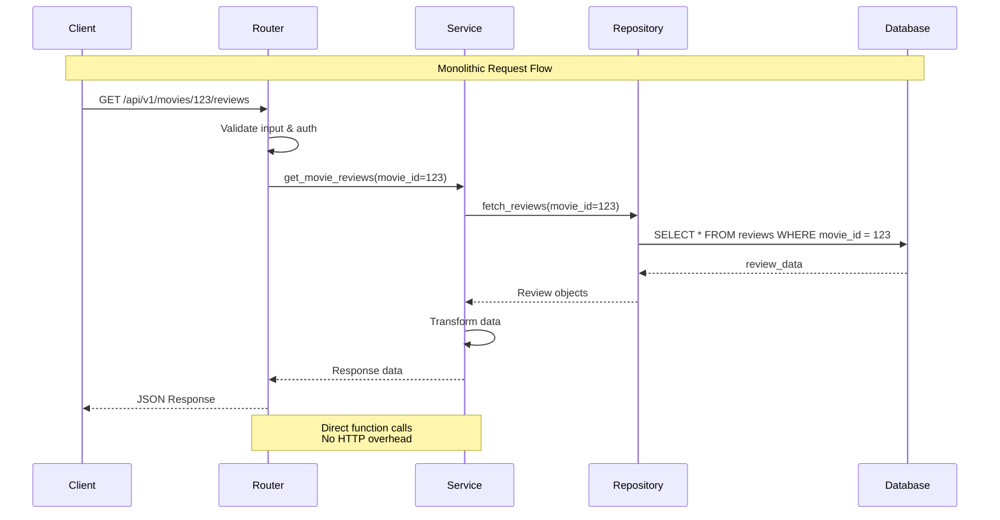
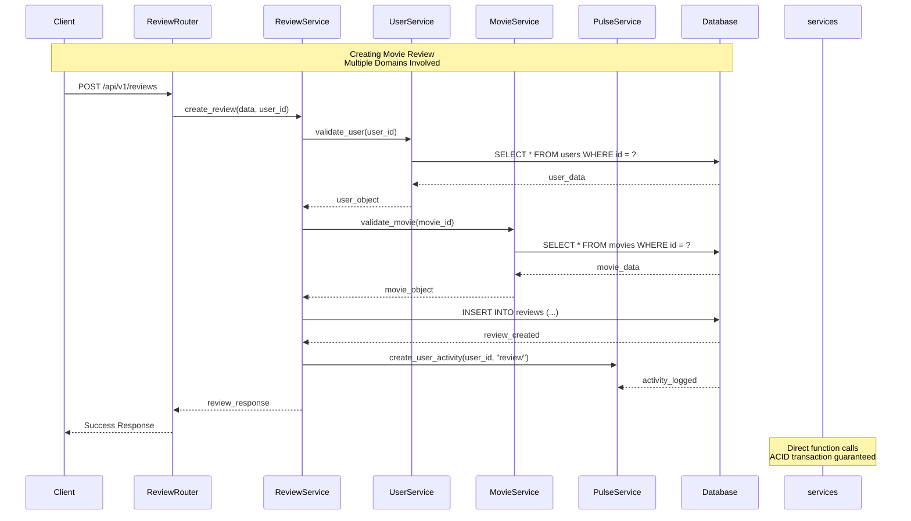

# 🎨 CORRECTED Visual Architecture - Monolithic Structure

This file contains the corrected Mermaid diagrams showing the **MODULAR MONOLITH** architecture, not microservices.

## 1. Corrected System Architecture Overview

```mermaid
graph TB
    subgraph "Client Layer"
        A[React Web App<br/>Next.js 15]
        B[Mobile Apps<br/>React Native]
        C[Admin Panel<br/>Next.js Dashboard]
    end
    
    subgraph "API Gateway Layer"
        D[AWS Application<br/>Load Balancer]
        E[CloudFront CDN]
    end
    
    subgraph "MONOLITHIC FASTAPI APPLICATION"
        F[Single FastAPI App<br/>Port 8000]
        
        subgraph "Domain Routers (In-App)"
            G[movies_router.py]
            H[users_router.py]
            I[critics_router.py]
            J[reviews_router.py]
            K[pulse_router.py]
            L[admin_router.py]
            M[industry_router.py]
            N[quiz_router.py]
        end
        
        subgraph "Domain Services (In-App)"
            O[movies_service.py]
            P[users_service.py]
            Q[critics_service.py]
            R[reviews_service.py]
            S[social_service.py]
        end
        
        subgraph "Domain Repositories (In-App)"
            T[movies_repo.py]
            U[users_repo.py]
            V[critics_repo.py]
            W[reviews_repo.py]
            X[social_repo.py]
        end
    end
    
    subgraph "Single Database"
        Y[(PostgreSQL Database<br/>All Tables)]]
        Z[(Redis Cache<br/>Sessions & Data)]
    end
    
    subgraph "External Integrations"
        AA[TMDB API<br/>Movie Database]
        BB[Gemini AI<br/>Recommendations]
        CC[Cloudinary<br/>Image Processing]
        DD[Email Service<br/>SendGrid]
    end
    
    A --> D
    B --> D
    C --> D
    D --> E
    E --> F
    
    F --> G
    F --> H
    F --> I
    F --> J
    F --> K
    F --> L
    F --> M
    F --> N
    
    G --> O
    H --> P
    I --> Q
    J --> R
    K --> S
    
    O --> T
    P --> U
    Q --> V
    R --> W
    S --> X
    
    T --> Y
    U --> Y
    V --> Y
    W --> Y
    X --> Y
    
    F --> Z
    
    O --> AA
    P --> BB
    O --> CC
    F --> DD
    
    Note over F,AA: All communication within<br/>single FastAPI application
```

## 2. Monolithic Backend Structure

```mermaid
graph TB
    subgraph "Single FastAPI Application"
        A[main.py<br/>Application Entry Point]
        
        subgraph "HTTP Layer"
            B[movies_router.py]
            C[users_router.py]
            D[critics_router.py]
            E[reviews_router.py]
            F[pulse_router.py]
            G[admin_router.py]
        end
        
        subgraph "Business Logic Layer"
            H[movies_service.py]
            I[users_service.py]
            J[critics_service.py]
            K[reviews_service.py]
            L[social_service.py]
        end
        
        subgraph "Data Access Layer"
            M[movies_repository.py]
            N[users_repository.py]
            O[critics_repository.py]
            P[reviews_repository.py]
            Q[social_repository.py]
        end
        
        subgraph "Shared Components"
            R[models.py<br/>100+ SQLAlchemy Models]
            S[schemas.py<br/>Pydantic Schemas]
            T[config.py<br/>Settings]
            U[db.py<br/>Database Session]
            V[auth.py<br/>Authentication]
        end
    end
    
    A --> B
    A --> C
    A --> D
    A --> E
    A --> F
    A --> G
    
    B --> H
    C --> I
    D --> J
    E --> K
    F --> L
    
    H --> M
    I --> N
    J --> O
    K --> P
    L --> Q
    
    M --> R
    N --> R
    O --> R
    P --> R
    Q --> R
    
    M --> S
    N --> S
    O --> S
    P --> S
    Q --> S
    
    A --> T
    A --> U
    A --> V
    
    Note over A,Z: Single application<br/>No service boundaries
```

## 3. Request Flow in Monolith



## 4. Cross-Domain Operations



## 5. Database Schema (Single Database)

```mermaid
erDiagram
    User {
        int id PK
        string email UK
        string username UK
        string full_name
        enum role
        timestamp created_at
    }
    
    UserRoleProfile {
        int id PK
        int user_id FK
        string profile_type
        jsonb profile_data
    }
    
    Movie {
        int id PK
        string title
        string overview
        date release_date
        float rating
        string tmdb_id UK
    }
    
    Person {
        int id PK
        string name
        string biography
        string tmdb_id UK
    }
    
    Review {
        int id PK
        int user_id FK
        int movie_id FK
        string content
        int rating
        timestamp created_at
    }
    
    MovieGenre {
        int movie_id FK
        int genre_id FK
        primary key (movie_id, genre_id)
    }
    
    MoviePerson {
        int movie_id FK
        int person_id FK
        string character_name
        enum role_type
    }
    
    CriticProfile {
        int id PK
        int user_id FK
        string professional_name
        boolean is_verified
    }
    
    CriticReview {
        int id PK
        int critic_id FK
        int movie_id FK
        string content
        float rating
    }
    
    Pulse {
        int id PK
        int user_id FK
        string content
        enum post_type
        int movie_id FK
    }
    
    %% Single database, all tables accessible
    User ||--o{ UserRoleProfile : has
    User ||--o{ Review : writes
    User ||--o{ Pulse : posts
    User ||--o{ CriticProfile : may_have
    
    Movie ||--o{ MovieGenre : has
    Movie ||--o{ MoviePerson : features
    Movie ||--o{ Review : receives
    Movie ||--o{ CriticReview : reviewed_by
    Movie ||--o{ Pulse : discussed_in
    
    Person ||--o{ MoviePerson : appears_in
    CriticProfile ||--o{ CriticReview : writes
    
    %% All in ONE database
    Note over User,Pulse: All tables in single PostgreSQL database<br/>ACID transactions across all domains
```

## 6. Deployment Architecture (Single Container)

```mermaid
graph TB
    subgraph "AWS Region"
        subgraph "ECS Fargate"
            A[Single ECS Task<br/>FastAPI Monolith]
            
            subgraph "Container"
                B[FastAPI Application<br/>Port 8000]
                C[Domain Routers]
                D[Domain Services]
                E[Domain Repositories]
            end
            
            A --> B
            B --> C
            B --> D
            B --> E
        end
        
        subgraph "Load Balancer"
            F[Application Load Balancer<br/>Port 8000]
        end
        
        subgraph "Database"
            G[(RDS PostgreSQL<br/>All Tables)]]
        end
        
        subgraph "Cache"
            H[(ElastiCache Redis<br/>Sessions & Cache)]]
        end
    end
    
    Internet --> F
    F --> A
    A --> G
    A --> H
    
    Note over A,G: Single container<br/>Single database<br/>All domains together
```

## 7. Data Flow (Single Transaction)

```mermaid
graph TD
    A[Client Request] --> B[Load Balancer]
    B --> C[FastAPI Monolith]
    
    subgraph "Within Monolith"
        D[Router Layer]
        E[Service Layer]
        F[Repository Layer]
        G[Single Database Connection]
    end
    
    C --> D
    D --> E
    E --> F
    F --> G
    
    subgraph "Database Transaction"
        H[User Validation]
        I[Movie Validation]
        J[Create Review]
        K[Update Movie Stats]
        L[Create User Activity]
        M[Commit Transaction]
    end
    
    G --> H
    H --> I
    I --> J
    J --> K
    K --> L
    L --> M
    
    M --> N[Response to Client]
    
    Note over H,M: ACID transaction across all operations<br/>All in single database connection
```

## 8. Monolith vs Microservices Comparison

```mermaid
graph TB
    subgraph "MONOLITH (Current)"
        A[Single FastAPI App]
        B[All Domain Routers]
        C[All Domain Services]
        D[All Domain Repositories]
        E[Single Database]
        
        A --> B
        B --> C
        C --> D
        D --> E
        
        F[Pros:]
        G[✅ Simple deployment]
        H[✅ ACID transactions]
        I[✅ No network latency]
        J[✅ Easy debugging]
        K[✅ Lower cost]
    end
    
    subgraph "MICROSERVICES (Not Implemented)"
        L[Auth Service]
        M[User Service]
        N[Movie Service]
        O[Review Service]
        
        P[Auth Database]
        Q[User Database]
        R[Movie Database]
        S[Review Database]
        
        L -.->|HTTP/gRPC| P
        M -.->|HTTP/gRPC| Q
        N -.->|HTTP/gRPC| R
        O -.->|HTTP/gRPC| S
        
        T[Cons:]
        U[❌ Complex deployment]
        V[❌ Distributed transactions]
        W[❌ Network latency]
        X[❌ Complex debugging]
        Y[❌ Higher cost]
    end
    
    Note over A,L: Current: Monolithic<br/>Better for current scale and complexity
```

## 9. Future Evolution Path

```mermaid
graph TD
    A[Current Monolith<br/>Single FastAPI App] --> B{Scale Requirements}
    
    B -->|Team < 20, Users < 1M| C[Stay Monolithic<br/>Optimize & Scale Vertically]
    
    B -->|Team 20-50, Users 1M-10M| D[Extract Low-Risk Services]
    
    subgraph "Extraction Candidates"
        E[Authentication Service]
        F[Notification Service]
        G[File Upload Service]
        H[Analytics Service]
    end
    
    D --> E
    D --> F
    D --> G
    D --> H
    
    B -->|Team > 50, Users > 10M| I[Full Microservices<br/>Event-Driven Architecture]
    
    C --> J[Enhanced Monolith<br/>Optimized performance]
    E --> K[Monolith + Auth Service]
    F --> K
    G --> K
    H --> K
    
    I --> L[Services Mesh<br/>Distributed System]
    
    Note over A,I: Gradual evolution based on<br/>actual scale requirements
```

## Key Architecture Characteristics

### ✅ **Modular Monolith Benefits for Movie Madders:**

1. **Rapid Development** - Single codebase, fast iteration
2. **ACID Transactions** - Complex operations across domains
3. **Cost Effective** - Single infrastructure deployment
4. **Easy Debugging** - Single application log
5. **Data Consistency** - Shared database with referential integrity

### 🎯 **Perfect For:**
- Complex business rules spanning multiple domains
- Strong consistency requirements
- Rapid feature development
- Small to medium development teams
- Cost-conscious deployments

### 📊 **Scale Considerations:**
- **Current**: Handles 100K+ users efficiently
- **Short-term**: Can scale to 1M+ users vertically
- **Long-term**: Consider service extraction when team/bteam grows significantly

This corrected analysis shows that the **modular monolith is the right architectural choice** for Movie Madders at its current stage, providing the best balance of simplicity, performance, and maintainability.
